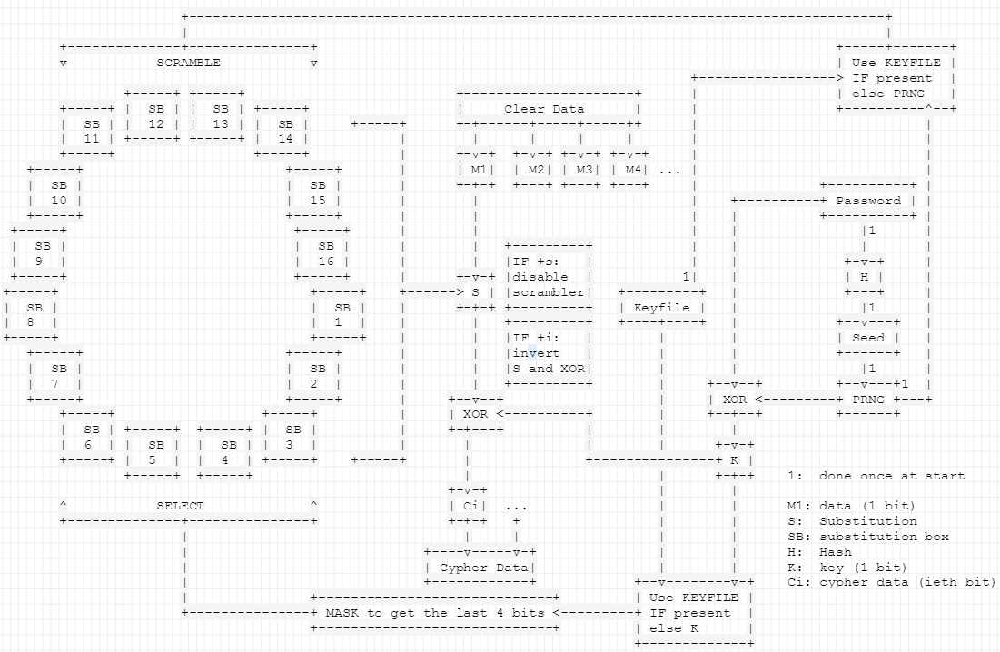

enigmax
=====
permet de chiffrer et de déchiffrer toutes les données entrées en paramètre.     
Le mot de passe demandé au début est hashé puis sert de graine pour le PRNG(générateur de nombre aléatoire).    
Le PRNG permet de fournir une clé unique égale à la longueur du fichier à coder.    
La clé unique subit un xor avec le mot de passe (le mot de passe est répété autant de fois que nécéssaire).    
Le fichier subit un xor avec cette clé Puis un brouilleur est utilisé, il mélange la table des caractères (ascii) en utilisant le PRNG et en utilisant le keyfile s'il est fourni.    
256 tables de brouillages sont utilisées au total.

Can crypt and decrypt any file given in argument.    
The password asked is hashed to be used as a seed for the PRNG.    
The PRNG gives a unique key which has the same length as the source file.    
The key is xored with the password (the password is repeated as long as necessary).    
The file is then xored with this new key, then a scrambler is used.    
it scrambles the ascii table using the PRNG or the keyFile given.
256 scramble's tables are used.


## Installation
Simply use the makefile
```
make
```

or enter the command corresponding to your environment  
**MAC**:
```
clang -Ofast -fno-unroll-loops -O3 main.c -o enigmax
```

**LINUX**:
```
gcc -funroll-loops -O3 -std='c11' main.c -o enigmax
```

**WINDOWS** (with BASH for windows only):
```
gcc -funroll-loops -O3 -std='c11' main.c -o enigmax
```

You can put the compiled file "enigmax" in your path to use it everywhere
```
export PATH="$PATH:/PATH/TO/enigmax"
```
Or you can make an alias
```
alias enigmax='PATH/TO/enigmax'
```
write one of them in your ~/.bashrc(linux) or ~/.bash_profile(mac) if you want it to stay after a reboot

to add man support, you have to add the man page in your personal man pages and update man
```
# open terminal in the project folder
sudo cp ./enigmax.1.gz /usr/local/share/man/man1/
sudo mandb
```

## Usage :

```
./enigmax [options] FILE [KEYFILE]
```

### Options :

**-h | --help:**
  *further help.*

**-k | --keyfile**
  *generate keyfile*

**-s (simple):** 
  *disable the scrambler*

**-i (inverted):**
  *invert the coding/decoding process, for coding it xors then scrambles and for decoding it scrambles then xors*

**-n (normalised):**
  *normalise the size of the keyfile, if the keyfile is too long (over 1 cycle in the Yates and Fisher algorithm) it will be croped to complete 1 cycle*

**-d (destroy):**
  *write on top of the source file (securely erase source data), except when the source is a folder where it's just deleted by the system at the end)*

**-f (force):**
  *never ask something to the user after entering password (overwrite the output file if it already exists and treat the second argument as a file if it looks like a set of options)*

**-r (randomize)**
  *randomize the name of the output file but keeping the extension intact*

**-R (full randomize)**
  *randomize the name of the output file included the extension*
  
**FILE|DIRECTORY:**
  *the path to the file or directory to crypt/decrypt*
  
**KEYFILE:**
  *the path to a file which will be used to scramble the substitution's tables and choose in which order they will be used instead of the PRNG only (starting at 16 ko for the keyfile is great, however not interesting to be too heavy)*


## Example :


**the command:**

```
enigmax file1
```

lets you choose between crypting or decrypting then it will prompt for a password that crypt/decrypt file1 as xfile1 in the same folder, file1 is not modified.

**the command:**

```
enigmax file2 keyfile1
```

lets you choose between crypting or decrypting, will prompt for the password that crypt/decrypt file2, uses keyfile1 to generate the scrambler then crypt/decrypt file2 as xfile2 in the same folder, file2 is not modified.

**the command:**

```
enigmax -s file3
```

lets you choose between crypting or decrypting, will prompt for a password that crypt/decrypt the file without using the scrambler(option 's'), resulting in using the unique key only.

**the command:**

```
enigmax -i file4 keyfile2
```

lets you choose between crypting or decrypting, uses keyfile2 to generate the scramble table and will prompt for a password that crypt/decrypt the file but will inverts the process(option 'i'): first it xors then it scrambles for the coding process or first it unscrambles then it xors for the decoding process

**the command:**

```
enigmax -dni file5 keyfile2
```

lets you choose between crypting or decrypting, will prompt for a password that crypt/decrypt the file but generates the substitution's tables with the keyfile passing only one cycle of the Fisher & Yates algorythm(option 'n'), inverts the scrambling phase with the xoring phase(option 'i') and destroy the source file afterwards(option 'd')

**the command:**

```
enigmax -k file6
```

generate a keyfile and use it to crypt/decrypt the file

**the command:**

```
enigmax --keyfile
```

only generate a keyfile and put it in the current directory

**the command:**

```
enigmax --help
```

display further help

## How it works


